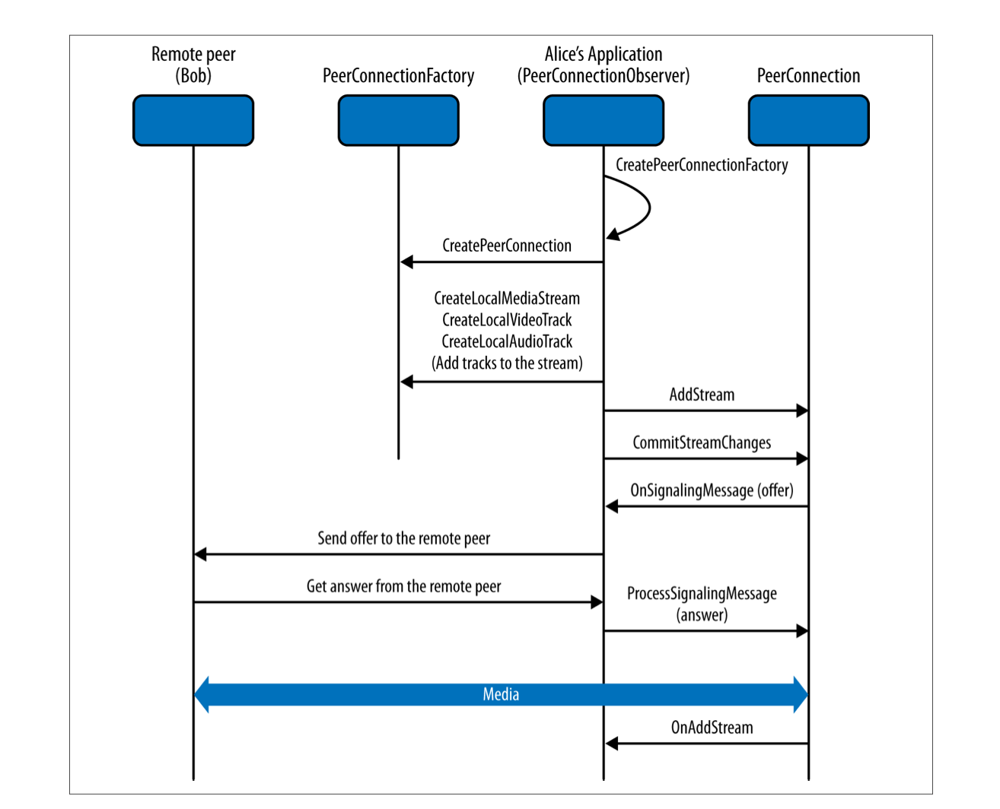

#认识和入门 WebRTC#

>WebRTC，名称源自网页即时通讯（英语：Web Real-Time Communication）的缩写，是一个支持网页浏览器进行实时语音对话或视频对话的API。它于2011年6月1日开源并在Google、Mozilla、Opera支持下被纳入万维网联盟的W3C推荐标准

一、引言
	最近有在关注Google IO 2016的同学应该知道，google发布了新的一款视频聊天工具Duo(http://www.coolapk.com/apk/com.google.android.apps.tachyon),这款应用是基于 Google全新的QUIC和WebRTC协议开发的，也就是我们今天这篇文章需要介绍的主角WebRTC。
	
二、它是什么
	正如导语所言WebRTC是一种视频通话的一种标准，目的是通过浏览器提供简单的JS就可以达到实时通讯的能力.除了Safari之外，主流的Chrome,Firefox,Opera已经在最新的浏览器中支持WebRTC很久了，Firefox更利用WebRTC制作了Hello应用，有兴趣的同学可以在Firefox浏览器的右上角找到它，并快速的发起一个视频会议。
	
	
三、过程描述
    只需要做到以下的十步，你就可以完成一个简单的WebRTC视频应用了。
    
  
  
  1. 从本地的设备中获取一个MediaStream 对象
  2. 从本地 MediaStream中获取一个URL blob
  3. 使用获得的URL blob在本地设备中做预览
  4. 创建一个RTCPeerConnectiond对象
  5. 将本地Stream添加到步骤4中创建的Connection对象中
  6. 发你的本地session 描述到远程服务器.
  7. 接受远程设备的远程session 描述 
  8. 处理你接受到的远程session描述，并将远程stream添加到你的RTCPeerConnectiond。
  9. 通过远程的stream，获取它的URL blob。
  10. 使用获取到的URL blob去播放远程设备的音频和视频。
  
  至此10步，我们就完成了一个简单的1:1视频的过程了.
 
四、主要的API描述

  WebRTC原生APIs文件是基于WebRTC规格书[1]撰写而成，这些API可分成Network Stream API、 RTCPeerConnection、Peer-to-peer Data API三类。
	
###Network Stream API###
   `MediaStream`：MediaStream用来表示一个媒体数据流。
   `MediaStreamTrack`在浏览器中表示一个媒体源。
   
###RTCPeerConnection###
   `RTCPeerConnection`：一个RTCPeerConnection对象允许用户在两个浏览器之间直接通讯。
   `RTCIceCandidate`：表示一个ICE协议的候选者。
   `RTCIceServer`：表示一个ICE Server。

###Peer-to-peer Data API###
   `DataChannel`：数据通道（DataChannel）接口表示一个在两个节点之间的双向的数据通道。
   
五、学习的资源

  针对于WebRTC的爱好学习者，本文罗列了一些学习的资源(干货)供大家参考。
  
  1. [WebRTC Home](https://webrtc.org/)
  2. [WebRTC Android](https://webrtc.org/native-code/android/)
  3. [WebRTC iOS](https://webrtc.org/native-code/ios/)
  4. [WebRTC G](http://g.co/webrtc)
  5. [Muaz Kha 大神](https://www.webrtc-experiment.com/)
  6. [Github list](https://github.com/search?utf8=%E2%9C%93&q=webrtc)
  
  参考示例:
  
  1. [AppRTC Github](https://github.com/webrtc/apprtc)
  2. [AppRTC DEMO](https://appr.tc/)
  3. [Hublin Github](https://github.com/linagora/hublin)
  4. [Hublin DEMO](https://hubl.in/)
  5. AppStore 搜WebRTC ---> 一堆应用基于WebRTC

  第三方接入服务:
  
  1. [pubnub](https://github.com/pubnub/webrtc)
  2. [tokbox](https://tokbox.com/)
  3. [oovoo](https://developers.oovoo.com)
  4. [sinch](https://www.sinch.com/products/webrtc/)

  书籍（PPT）下载:
  1. [WebRTC Tutorial](http://pan.baidu.com/s/1pLQqv3P)
  2. [WebRTC G PPT](http://pan.baidu.com/s/1c1Gnkti)
  3. [Real-time-communication-with-webrtc-peer-to-peer-in-the-browser](http://pan.baidu.com/s/1qXDgQVM)
  4. [WebRTCIEEE](http://pan.baidu.com/s/1i5tY6pf)

##版权申明

>版权归原作者所有，这里仅做收集整理，欢迎自由转载-非商用-非衍生-保持署名和链接。

>本文中内容将持续更新。

>ps:本文作者系代码牛(面对面的技术分享平台)讲师keepcleargas，正在进行基于WebRTC的学习和开发，有兴趣的可关注 代码牛 公众号，获取最新的WebRTC项目的最新博客信息.